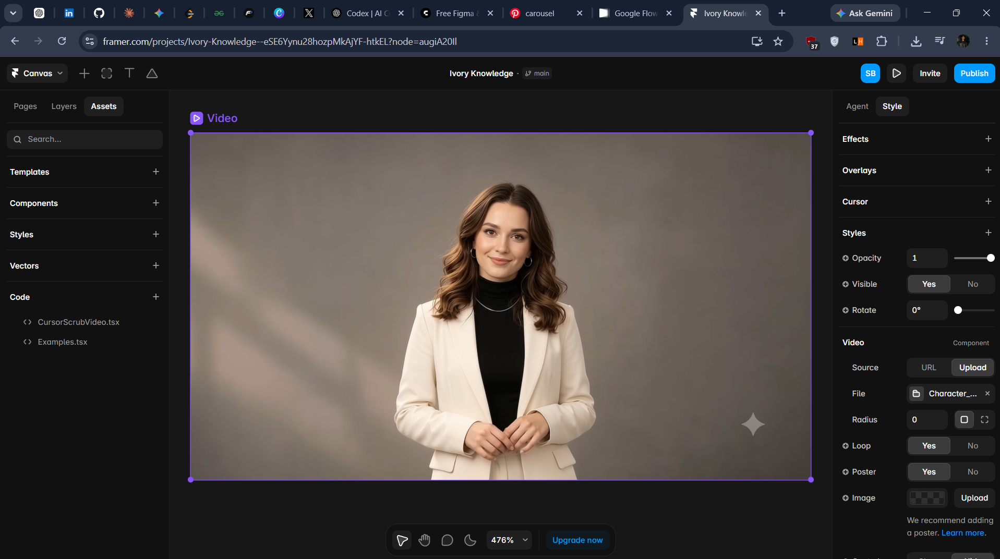
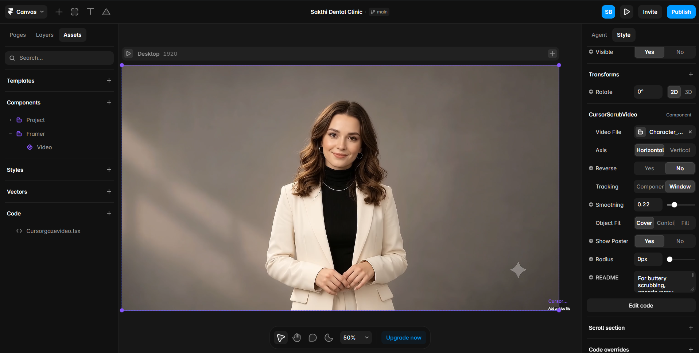
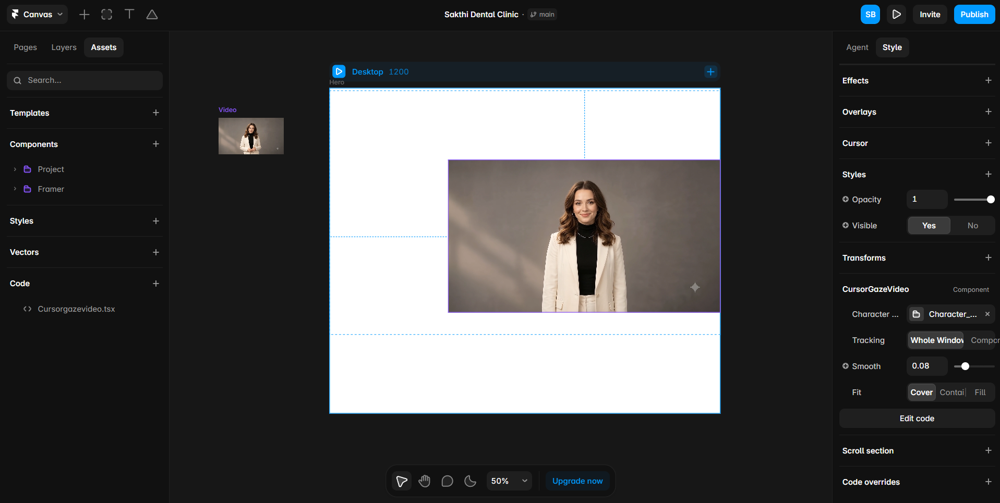
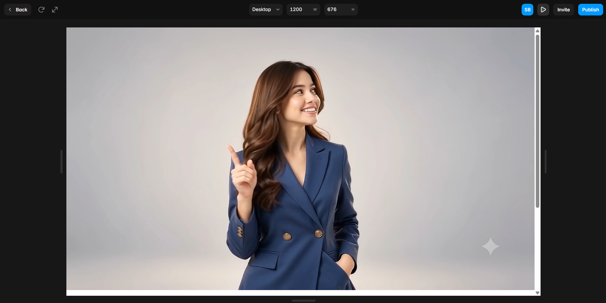
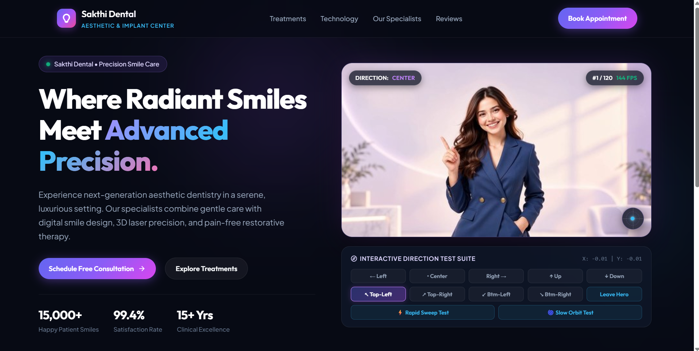
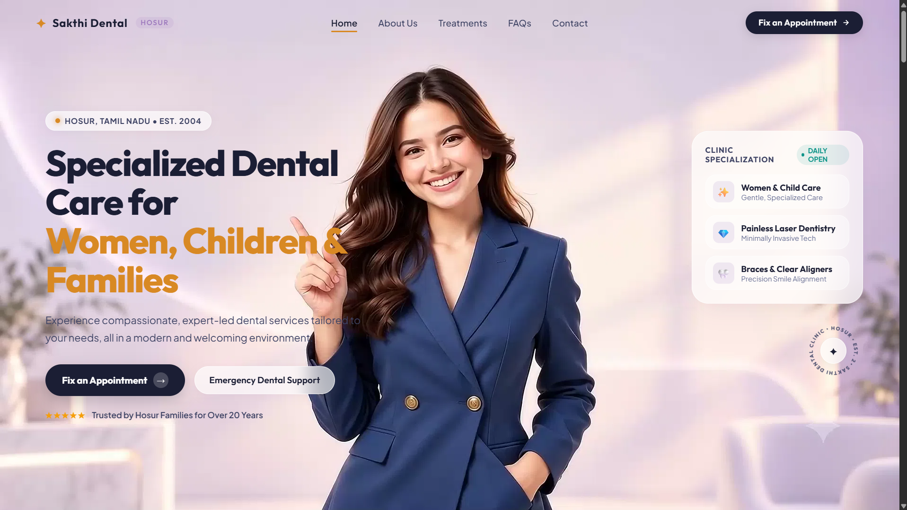

# 🦷 Sakthi Dental Clinic — Interactive Dental Website

> A modern, responsive and interactive website developed for Sakthi Dental Clinic, Hosur, Tamil Nadu, featuring a cinematic cursor-controlled character hero.

---

## 🚀 Project Overview

Sakthi Dental Clinic is a modern healthcare website designed to provide patients with a clean, professional and easy-to-navigate digital experience.

Deployed Link : 
[sakthi-dental-clinic-blond.vercel.app](https://sakthi-dental-clinic-jrbq91du7.vercel.app/)

The project was developed around a detailed clinic requirement and focuses on:

- Patient-friendly information architecture
- Responsive design
- Modern UI/UX
- Dental treatments and services
- Doctor and specialist information
- Patient testimonials
- FAQs
- Appointment CTAs
- Contact and lead capture
- Interactive visual experiences

One of the most challenging and experimental parts of the project was the **cursor-controlled character hero**.

Instead of using a normal static hero image, I wanted the character to feel interactive — responding naturally to the user's cursor movement.

What followed was a long process of experimentation, failed approaches, debugging and optimization before arriving at the final implementation.

---

# 🎯 Problem I Wanted to Solve

I wanted the hero section to do more than simply display an image.

The goal was to create an experience where:

> **The character visually responds to the user's cursor movement.**

The character should appear to look toward different directions depending on where the user moves the cursor.

The interaction needed to feel:

- Natural
- Smooth
- Responsive
- High quality
- Visually engaging
- Lightweight enough to use in a real website

The biggest challenge was achieving this while working with high-resolution character footage.

---

# 👁️ Interactive Cursor-Controlled Hero

The final hero uses a **1920×1080 character animation sequence containing 2,400 frames**.

The cursor position is mapped to directional states and corresponding animation frames.

The interaction supports directions such as:

- Center
- Left
- Right
- Up
- Down
- Top-Left
- Top-Right
- Bottom-Left
- Bottom-Right

The final interface also includes an interactive direction testing system that helped me test and validate the character's response to different cursor positions.

---

# 🖼️ The Starting Point

Before building the final interaction, I first focused on creating the visual foundation of the website.

<p align="center">
  
</p>

The initial goal was to establish the clinic's visual identity, layout, typography and overall user experience before experimenting with the interactive hero.

---

# 🧪 The Journey — From Failed Experiments to a Working Solution

The most interesting part of this project wasn't just the final result.

It was the process of getting there.

I experimented with multiple approaches before finding an implementation that provided the level of interaction and visual quality I wanted.

---

## 1️⃣ First Approach — Cursor-Scrubbed Video

The first idea was relatively simple:

> Use a video and control its playback position according to the cursor.

The concept was to map:

```text
Cursor Position
       ↓
Normalized X/Y
       ↓
Video Progress
       ↓
Displayed Frame
```
I experimented with a custom cursor-scrubbing component and different tracking configurations.
Initial Result
<p align="center">
  
</p>

The concept worked, but several problems appeared:
- Playback did not feel completely smooth
- Rapid cursor movement caused visible jumps
- Video seeking introduced latency
- Direction changes were not always natural
- The interaction did not provide enough control over individual frames
This made it clear that a normal video-seeking approach was not ideal for the interaction I wanted.

## 2️⃣ Second Approach — Interactive Video Component

I then experimented with a custom component specifically designed around cursor-controlled video.
The component provided controls for:
- Video source
- Tracking area
- Horizontal/vertical tracking
- Reverse playback
- Smoothing
- Object fit
- Poster image
- Border radius
The goal was to make the character respond smoothly to the user's cursor while keeping the implementation reusable.
Development Experiment
<p align="center">
  
</p>

This approach helped me understand the fundamentals of:
- Cursor tracking
- Normalized coordinates
- Video timeline control
- Smoothing
- Interactive media components
However, the underlying video-seeking limitations remained.

## 3️⃣ Third Approach — Dedicated Cursor-Gaze Component

Instead of treating the character as a normal video, I started treating the hero as an interactive visual system.
I created a dedicated cursor-gaze component that tracked the cursor across the browser window.
The basic pipeline became:
Mouse Movement
      ↓
Cursor Coordinates
      ↓
Normalized Position
      ↓
Direction Detection
      ↓
Animation State
      ↓
Displayed Character Frame

Component Experiment
<p align="center">
  
</p>

This was a major improvement because the interaction could now be designed around the character's gaze instead of simply scrubbing a video timeline.

## 4️⃣ The Performance Problem

The next challenge was much bigger.
I wanted high-quality movement in multiple directions, which meant generating and working with a large number of frames.
The final animation source contained:
1920 × 1080 resolution
2,400 frames

That introduced several problems.
Problems encountered
<p align="center">
  
</p>

- Large amount of image data
- Frame loading delays
- Browser memory pressure
- Stuttering during rapid cursor movement
- Frame jumping
- Delayed responses
- Difficulty maintaining consistent visual quality
At this point, simply loading frames whenever the cursor moved was not enough.

## 5️⃣ Frame-Based Rendering

I then moved toward a frame-based approach.
Instead of relying entirely on video seeking, individual frames could be loaded and displayed according to the calculated cursor position.
The system became:
Cursor
  ↓
X / Y Position
  ↓
Direction + Target Position
  ↓
Target Frame
  ↓
Frame Cache
  ↓
Canvas
  ↓
Character Display

This gave me much more precise control over the animation.

## 6️⃣ Frame Caching

One of the important improvements was introducing frame caching.
Instead of continuously downloading and decoding every frame, nearby frames could be kept ready for quick access.
Conceptually:
Current Frame
     ↓
Nearby Frames Cached
     ↓
Cursor Moves
     ↓
Next Frame Already Available
     ↓
Faster Visual Response

This significantly improved the architecture of the interaction compared with repeatedly seeking through a large video.

## 7️⃣ Canvas Rendering

I also experimented with rendering the animation through a canvas rather than continuously replacing large DOM images.
The goal was to keep the visual rendering controlled through a single drawing surface.
The final rendering pipeline became:
Cursor Input
      ↓
Position Smoothing
      ↓
Direction Calculation
      ↓
Target Frame Calculation
      ↓
Frame Cache
      ↓
Canvas Rendering

This approach provided considerably more control over the animation system.

## 8️⃣ Testing Different Directions

Once the basic system was working, I needed a way to test whether the character was responding correctly.
I created an Interactive Direction Test Suite.
It allowed me to test:
- ← Left
- Center
- Right →
- ↑ Up
- ↓ Down
- ↖ Top-Left
- ↗ Top-Right
- ↙ Bottom-Left
- ↘ Bottom-Right
I also added rapid movement and slow orbit-style tests to evaluate how the animation behaved under different cursor movements.
Final Testing Interface
The testing process was important because an interaction can appear correct during slow movement but behave completely differently during rapid cursor movement.

## 9️⃣ Final Successful Implementation

After multiple iterations, I finally reached the interaction I was aiming for.
The final hero combines:
- High-resolution character animation
- Cursor tracking
- Direction detection
- Smooth cursor interpolation
- Frame selection
- Frame caching
- Canvas rendering
- Direction testing
- Responsive hero layout
Final Hero
<p align="center">
  
</p>

The character now responds to cursor movement while the surrounding website remains functional and responsive. But this is looks completely AI Polished so i changed the frontend completely to this:
<p align="center">
  
</p>

## 🧠 What This Process Taught Me

This was probably one of the most valuable parts of the project.
I initially thought the problem was simply:
"How do I make a character follow the cursor?"

But the real problem turned out to be:
"How do I create a responsive interactive animation system that can handle thousands of high-resolution frames without making the website unusable?"

That required thinking about:
- Animation architecture
- Browser rendering
- Frame management
- Memory usage
- Caching
- Cursor interpolation
- User interaction
- Performance
- Visual quality
The failed approaches were actually important because each one helped identify what the final system needed.

## 🏆 Final Result

The final website combines a professional healthcare interface with an interactive visual experience.
The completed hero provides:
- ✅ Cursor-controlled character interaction
- ✅ Multiple viewing directions
- ✅ 1920×1080 source quality
- ✅ 2,400-frame animation sequence
- ✅ Frame-based rendering
- ✅ Frame caching
- ✅ Canvas rendering
- ✅ Responsive layout
- ✅ Interactive testing tools
✨ Website Features
🦷 Treatments
Structured presentation of dental treatments and services.
👨‍⚕️ Specialists
Dedicated information about doctors and specialists.
⭐ Reviews
Patient testimonials and trust-building content.
🏥 Clinic Information
Facilities, accessibility and clinic information.
❓ FAQs
Common dental questions organized for easy access.
📅 Appointment CTA
Clear appointment actions throughout the website.
📩 Contact Form
Responsive contact form with validation.
📱 Responsive Design
Designed for:
- Desktop
- Laptop
- Tablet
- Mobile
🎨 Design Direction
The website focuses on a modern healthcare aesthetic with:
- Dark premium interface
- Purple and blue accent colors
- Clean typography
- High contrast
- Rounded UI elements
- Soft gradients
- Balanced spacing
- Interactive visual elements
The objective was to create a website that feels modern and premium without sacrificing usability.
🛠️ Tech Stack
Frontend
- React
- Vite
- TypeScript
- JavaScript
- HTML5
- CSS3
Interactive Experience
- Cursor tracking
- Canvas rendering
- Frame-based animation
- Frame caching
- Animation interpolation
Development
- Git
- GitHub
- VS Code
🎥 Video Demonstrations
The videos below document the progression from experimentation to the final working website.
1. Character Animation / Gaze Movement
[🎬 View Character Animation / Gaze Movement](./docs/videos/01-Character_animation_gaze_movement_1080p_20260926003206_240fps.mp4)
This video demonstrates the character gaze and directional interaction during development.
2. Cursor-Controlled Animation Errors
[🎬 View Cursor-Controlled Animation Experiment](./docs/videos/Cursorscontrolanimationerrorsstart.mp4)
This captures one of the experimental stages where the cursor-controlled animation still had issues.
3. First AI-Polished Website
[🎬 View First AI-Polished Website](./docs/videos/firstapolishedwebsite.mp4)
This shows an earlier polished version of the website before the final interaction and implementation were completed.
4. Final Website
[🎬 View Final Website Demo](./docs/videos/Finalwebsite.mp4)
This is the final implementation of the Sakthi Dental Clinic website and its interactive hero experience.
🚀 Final Takeaway
What started as a simple idea of making a character follow the cursor became a much deeper exploration of interactive animation.
The project went through:
Initial Website
      ↓
Video-Based Interaction
      ↓
Cursor Scrubbing
      ↓
Video Seeking Problems
      ↓
Custom Cursor-Gaze Component
      ↓
Frame Loading Problems
      ↓
Performance & Lag
      ↓
Frame-Based Rendering
      ↓
Frame Caching
      ↓
Canvas Rendering
      ↓
Direction Testing
      ↓
Final Working Interaction

The final result is not just a dental website.
It is an experiment in building a high-resolution, cursor-controlled interactive animation system while keeping the overall website responsive and usable.
